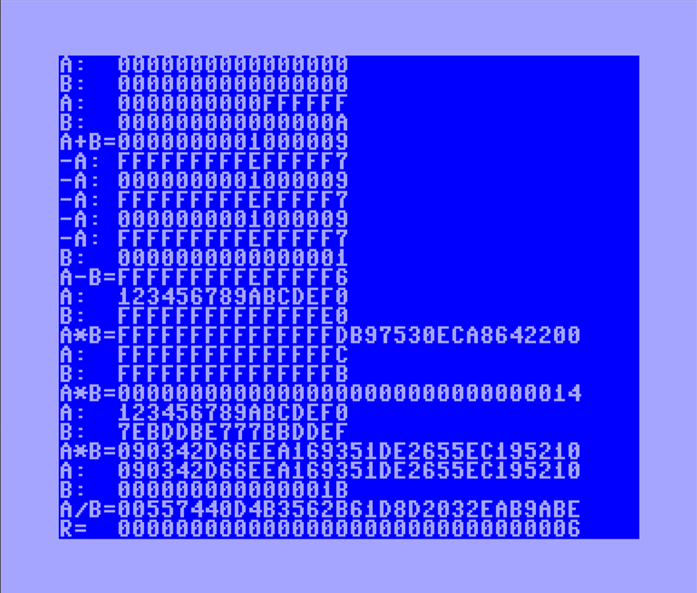

# int64 for C64 #

64-bit integer support in 6502 assembly language for Commodore 64

Methods implemented

* int64_zero - initialize with zero
* int64_arg1 - set first argument value
* int64_adc - 64-bit addition (with carry)
* int64_sbc - 64-bit subtraction (with carry)
* int64_compare - compare 64-bit numbers (sets Z, C)
* int64_negate - toggle negative/positive 64-bit number
* int64_mul - 64-bit multication result is 128-bit
* int128_div - 128-bit number divided by 64-bit, 128-bit result and remainder

Methods yet to be implemented
* int64_tostring
* int64_fromstring

Limitations

* build script requires Bash shell or equivalent (to do: add a batch file)
* division ignoring signed values, assuming unsigned for now
* 128-bit support is unsymmetrical, especially division
* recommend add full 8-bit/16-bit/32-bit/64-bit/128-bit support with mix
* adding macros for iterative low level operations could simplify code
* compare ignoring signed values, assuming unsigned for now
* missing implementation for converting to decimal output
* missing implementation for converting to binary output
* missing implementation for initializing from string (decimal, hex, binary)
* flags may not be correct for overflow, negative, etc.
* doesn't unroll loops, not focused on maximum speed performance

